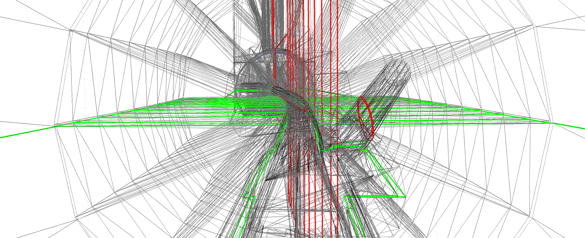

pyg4ometry
==========

Python code for rapid creation and conversion of radiation transport Monte
Carlo (Geant4 and Fluka) geometries.

Quick start
-----------

pyg4ometry is a very capable package to do many tasks related
to Geant4/Fluka/MCNP geometry:

- Python scripting to create and assemble geometries
- Loading, editing and writing GDML
- Load and tessellate CAD geometry and export to GDML
- Load ROOT geometry and convert to GDML
- Powerful VTK viewer of geometries
- Converting from GDML to FLUKA and MCNP
- Exporting mesh geometries from GDML to VTP, OBJ, VRML etc.
- Python bindings to CGAL allowing complex mesh manipulation (e.g. hole filling, remeshing)

All with few lines of Python code!

.. code:: python

    import pyg4ometry as pg4
    from g4edgetestdata import G4EdgeTestData

    g4data = G4EdgeTestData()
    # define a geometry registry
    reg = pg4.geant4.Registry()

    # build the world volume
    world_s = pg4.geant4.solid.Orb("WorldAir", 1.5, reg, lunit="cm")
    world_l = pg4.geant4.LogicalVolume(world_s, "G4_AIR", "WorldAir", reg)
    reg.setWorld(world_l)

    # import an STL file
    reader = pg4.stl.Reader(g4data["stl/utah_teapot.stl"], registry=reg)
    teapot_s = reader.getSolid()

    # place the teapot in the world
    teapot_l = pg4.geant4.LogicalVolume(teapot_s, "G4_Cu", "UtahTeapot", reg)
    pg4.geant4.PhysicalVolume([0, 0, 0], [0, 0, 0], teapot_l, "UtahTeapot", world_l, reg)

    # export to GDML file "geometry.gdml"
    writer = pg4.gdml.Writer()
    writer.addDetector(reg)
    writer.write("./geometry.gdml")

    # start an interactive VTK viewer instance
    viewer = pg4.visualisation.VtkViewer()
    viewer.addLogicalVolume(reg.getWorldVolume())
    viewer.view()

Check out our video tutorial for more:

.. image:: https://img.youtube.com/vi/OPvQFZsFvhs/maxresdefault.jpg
    :alt: YouTube video thumbnail
    :target: https://www.youtube.com/watch?v=OPvQFZsFvhs

Next steps
----------

.. toctree::
   :maxdepth: 2

   manual/index

.. toctree::
   :maxdepth: 2
   :caption: Development

   Source Code <https://github.com/g4edge/pyg4ometry>
   License <https://github.com/g4edge/pyg4ometry/blob/main/LICENSE>
   citation
   Changelog <https://github.com/g4edge/pyg4ometry/releases>
   version_history
   devmanual

Indices and tables
==================

* :ref:`genindex`
* :ref:`modindex`
* :ref:`search`
