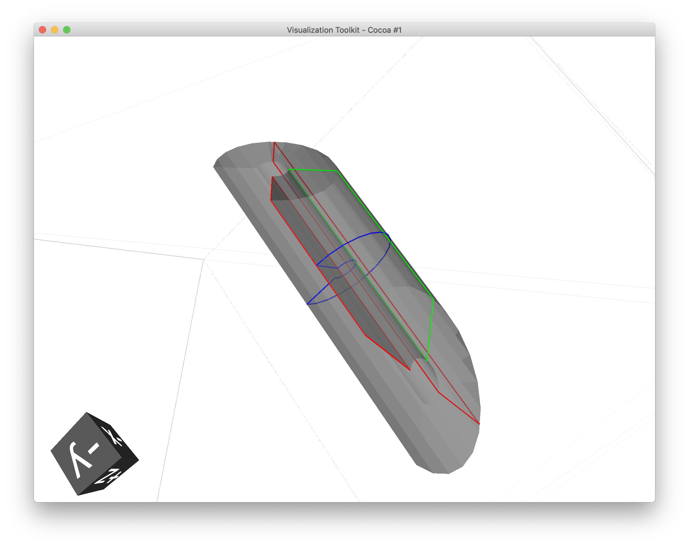
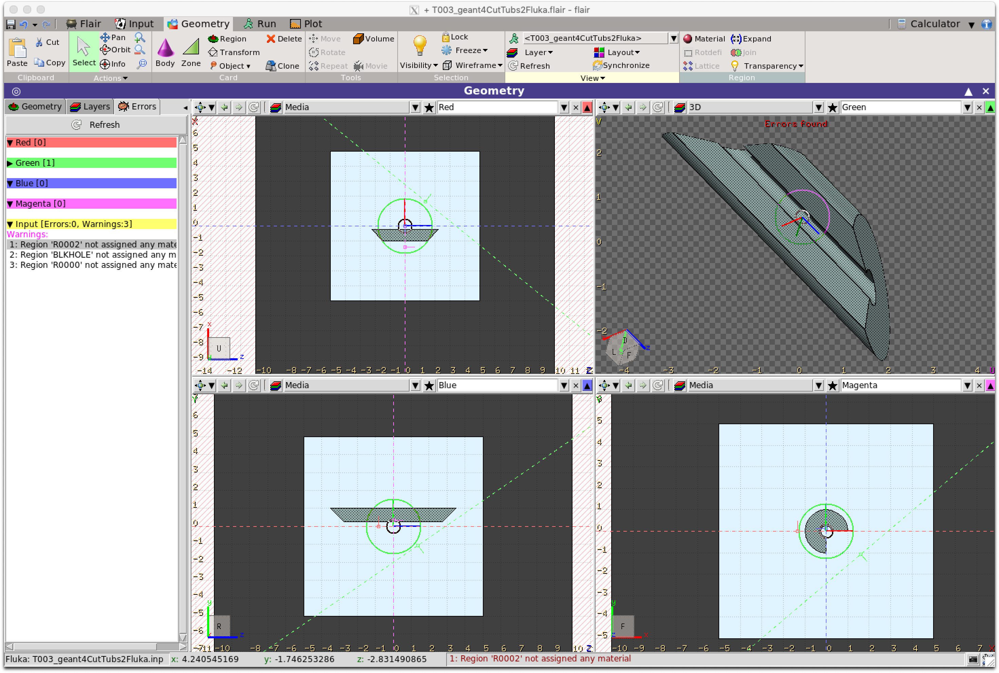
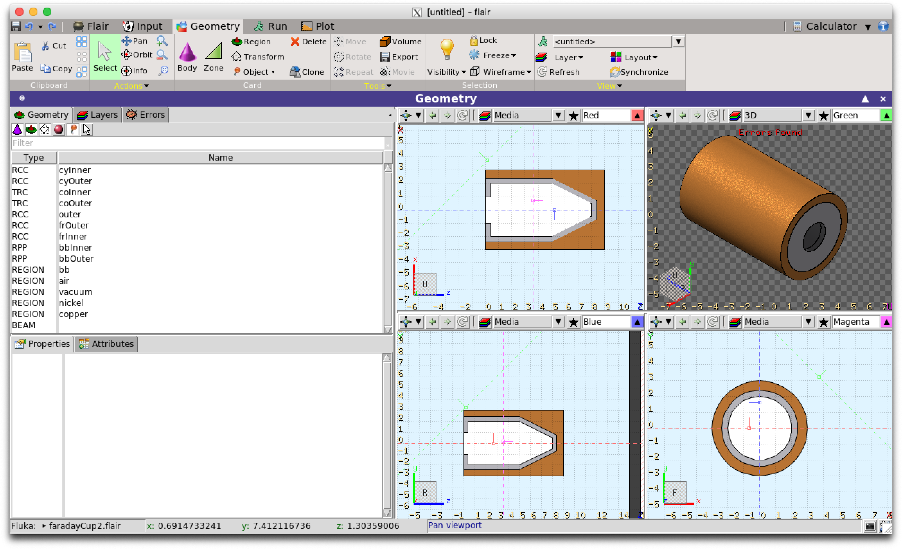
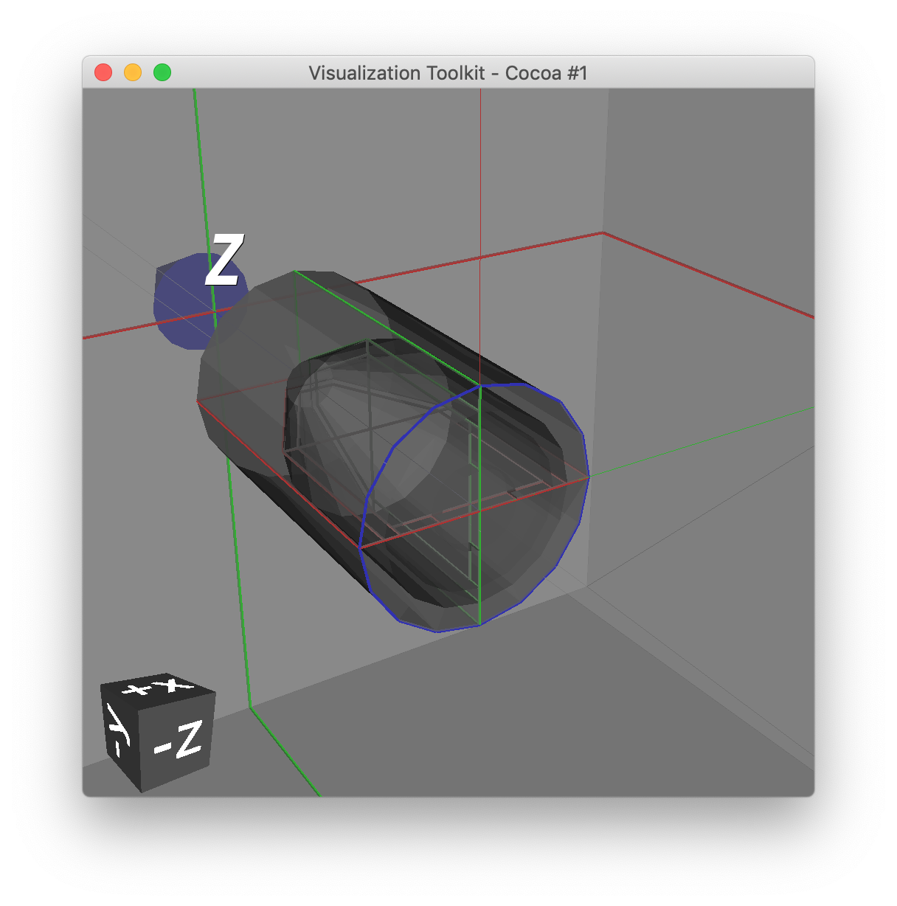

.. _converting:

===================
Converting Geometry
===================

Assembly Conversion
-------------------

It is possible transform a logical volume into an assembly volume. This
is useful in the case of two sources of geometry: placement of top level world
logical volume solids will likely result in an overlap. This effectively removes
the outermost logical volume but keeps the daughters. The produced assembly
volume can then be placed or imprinted somewhere in the geometry.

An assembly **cannot** be used as an outermost 'world' volume for a geometry hierarchy.

Assuming :code:`lv` is a :code:`pyg4ometry.geant4.LogicalVolume` instance:

.. code-block::

   av = lv.assemblyVolume()

GDML to FLUKA
-------------

It is possible convert a pyg4ometry geometry to FLUKA. This is currently a work in
progress and not all Geant4-GDML constructions are implemented, although they can
be quickly added. Given a LV variable named ``logical``

.. code-block :: python
   :linenos:

   import pyg4ometry
   reader = pyg4ometry.gdml.Reader("input.gdml")
   logical = reader.getRegistry().getWorldVolume()
   freg = pyg4ometry.convert.geant4Logical2Fluka(logical)
   w = pyg4ometry.fluka.Writer()
   w.addDetector(freg)
   w.write("FileName.inp")

If you want to load a file into Flair then a flair file can be written based on ``FileName.inp`` using the following

.. code-block :: python
   :linenos:

    extent = logical.extent(includeBoundingSolid=True)
    f = pyg4ometry.fluka.Flair("FileName.inp",extent)
    f.write("FileName.flair")

Here is an example (viewed in Flair) of a simple Geant G4 solid that has been converted to FLUKA using this
method

.. note::
   All GDML placements are respected in the conversion from GDML to FLUKA, for both Placements and
   Boolean Solids. So for example a tree of LV-PV placements are reduced into a single transformation
   of a LV into a global coordinate space for FLUKA. A similar process is used for a tree of CSG
   operations.

.. warning::

   Currently there are some things which are not implemented in the conversion. 1) Materials, 2) Scaled solids,
   3) Reflections in placements, 4) Division, replica and parameterised placements. Some of these are straight
   forward to implement, like Materials and the non-Placement physical volumes can be done quickly if a user
   requires it.

FLUKA To GDML
-------------

FLUKA geometry can be converted to GDML using
``pyg4ometry.convert.fluka2geant4``. The conversion process is robust and
supports all FLUKA geometry constructs.  Given a FLUKA file `model.inp`,
the following code can be used to translate it to a GDML file.

.. code-block :: python
   :linenos:

   import pyg4ometry.fluka as fluka
   import pyg4ometry.gdml as gdml
   from pyg4ometry.convert import fluka2Geant4

   # Read the FLUKA file, get the FlukaRegistry, convert the registry to a
   # Geant4 Registry
   reader = fluka.Reader("model.inp")
   flukaregistry = reader.flukaregistry
   geant4Registry = fluka2Geant4(flukaRegistry)

   worldLogicalVolume = geant4Registry.getWorldVolume()
   worldLogicalVolume.clipSolid()

   writer = gdml.Writer()
   writer.addDetector(geant4Registry)
   writer.write("model.gdml")

The core of this functionality is the translation of the `FlukaRegistry`
instance into the equivalent `Registry` (i.e. Geant4) instance.

Here is an example of a model viewed in flair and the resulting visualisation
in VTK of the Geant4 model

A number of keyword arguments are available to further modify the
conversion.  The `fluka2Geant4` keyword arguments `region` and
`omitRegions` allow the user to select a subset of the named regions to be
translated.

The conversion of QUA bodies (fluka2geant4 kwarg `quadricRegionAABBs`) is
complex and requires further explanation. In Pyg4ometry the mesh and GDML
representations of FLUKA infinite circular cylinders, elliptical cylinders
and half-spaces are all finite (but very large) cylinders, elliptical
cylinders and boxes.  This is robust as increasing the length of cylinders
and depth/breadth of boxes does not increase the number of polygons used in
the underlying mesh representation for that solid.  However, this is not
true of the quadric surface.  A quadric surface cannot simply be generated
to be "very large", as the number of polygons will grow quickly, along with
the memory consumption and facets in the resulting GDML TesselatedSolid,
which will also slowing down tracking time in Geant4.  For this reason the
user must provide axis-aligned bounding boxes of the regions where any QUA
bodies are present.  It is recommended that these boxes be a centimetre
larger than formally necessary to ensure a correct conversion.  Providing
the bounding box ensures that an efficient and accurate mesh of the QUA
bodies can be generated meaning that the conversion to be performed in a
tractable amount of time as well giving more performant tracking in Geant4.

CAD To GDML
-----------

CAD (STEP, IGES) files can be converted to GDML. This is based on
the OpenCASCADE libraries (the same as those used in FreeCAD).
The solids are in general tessellated and care must be taken with this type of conversion.
Depending on the complexity of the geometry the FreeCAD tessellation can
fail. In general there is not a requirement for CAD files to contain non-overlapping
solids (bodies). The mesh generation can be controlled by a dictionary (``mesh`` in the
example below) whose keys are the body name and values are parameters associated with the
tessellation.

.. code-block :: python
   :linenos:

   import pyg4ometry
   reader = pyg4ometry.pyoce.Reader("./file.stp”) # read the cad file
   fs = reader.freeShapes() # this is a little like the CAD equivalent of the world volume
   worldName = pyg4ometry.pyoce.pythonHelpers.get_TDataStd_Name_From_Label(fs.Value(1)) # get the actual string of the name
   mats={} # assignment of material to named objects
   mesh={} # control of the mesh generated for a named object
   skip=[] # list of named objects to skip
   reg = pyg4ometry.convert.oce2Geant4(reader.shapeTool, worldName, mats, skip, mesh, oceName=True) # oceName is essential as there are lots of degenerate names in the CAD

   # to write to GDML
   writer = pyg4ometry.gdml.Writer()
   writer.addDetector(reg)
   writer.write("./file.gdml”)

The conversion code is very similar to other format conversions. ``mats`` is a dictionary with key of body name and value of the
material name. The list ``skip`` is a list of body names to bypass the
conversion, for example if it is not required.
