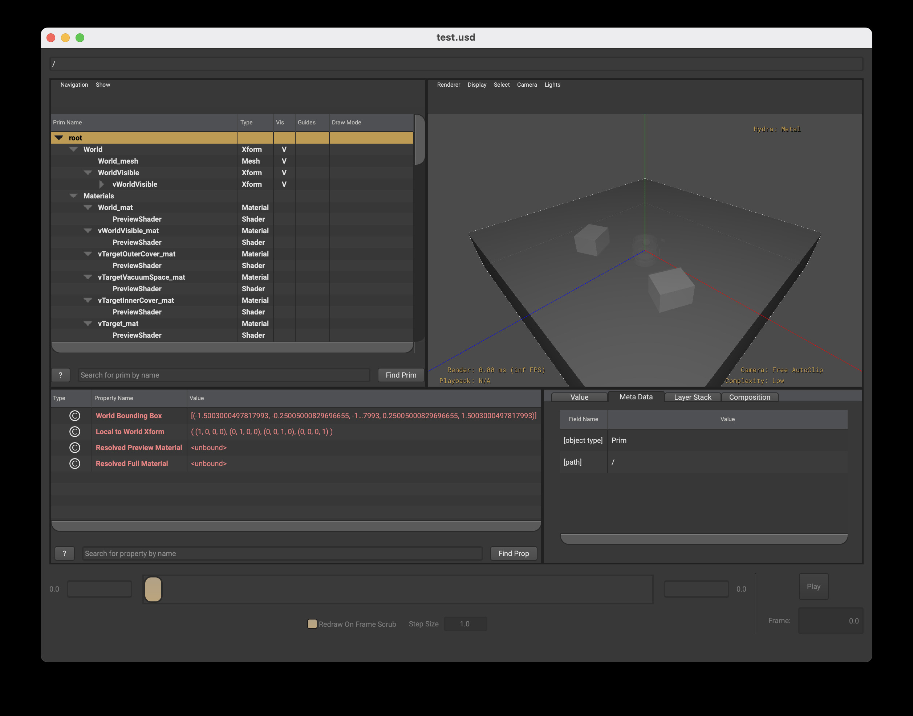
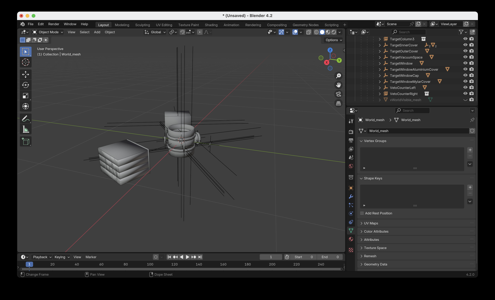

.. _rendering:

==================
Rendering Geometry
==================

There are many reasons to render geometry beyond the VTK based
pyg4omety viewer. Potential targets are 3D asset packages (e.g.
blender, houdini), games engines (unreal engine, unity). A common
format is Universal Scene Description (USD). USD can be loaded in
many packages and so a dedicated UDS converter/viewer is available
in pyg4ometry. For example to load and convert a file to USD

.. code-block:: python
    :linenos:

    r = pyg4ometry.gdml.Reader("lht.gdml")
    l = r.getRegistry().getWorldVolume()
    v = pyg4ometry.visualisation.UsdViewer("lht.usd")
    v.traverseHierarchy(l)
    v.save()

This will write a file called lht.gdml which can be viewed in
a USD viewer like usdview. USD has a preview shader. The settings
can set via the `VisualisationOptions` stored in logical volumes
(`visOption`), so for example

.. code-block:: python
    :linenos:

    r = pyg4ometry.gdml.Reader("lht.gdml")
    reg = r.getRegistry()
    reg.logicalVolumeDict["vCalorimeter"].visOptions.color = [1, 0, 0]
    v = pyg4ometry.visualisation.UsdViewer("lht.usd")
    v.traverseHierarchy(reg.getWorldVolume())
    v.save()

`visOptions.colour` and `visOptions.alpha` are passed though to the
USD shader. There are many more options for shading in USD which can
be accessed via `visOptions.usdOptions`

Here is an example of opening the usd file in `usdview`

USD can be imported to blender without any other conversion

