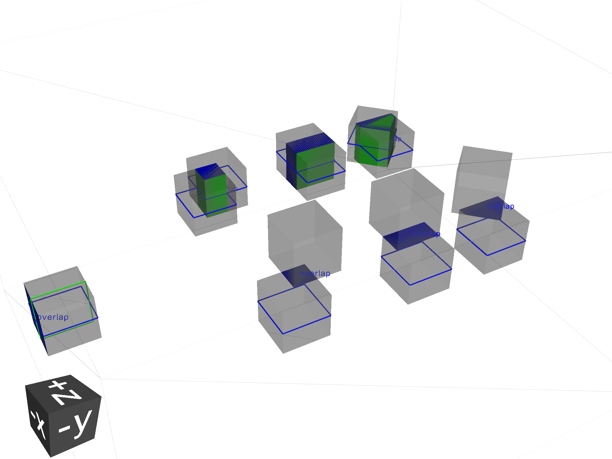

.. _validating:

===================
Validating Geometry
===================

Overlap Checking
----------------

"Overlaps" is a general term used to describe malformed geometry. Such geometry is unphysical
and may causing particle tracking problems in simulations such as stuck particles, or particles
completely missing certain volumes entirely. Such errors are rarely easy to spot from results
or running the simulation.

Given all the PVs (daughters) of a LV (mother) should be bounded by the LV/mother solid. It is
possible to check between all daughter solid meshes and between daughters and the mother solid mesh.
Given an :code:`pyg4ometry.geant4.LogicalVolume` instance ("lv"), this check can be performed by calling
the following code:

.. code-block :: python

    lv.checkOverlaps()

This will check only the immediate daughters of this logical volume. To descend further into
a geometry, the recursive flag can be used:

.. code-block :: python

    lv.checkOverlaps(recursive=True)

See :ref:`g4-module` : :code:`LogicalVolume.checkOverlaps()` for full details. A more
complete example is:

.. code-block :: python
   :emphasize-lines: 5
   :linenos:

   # cd pyg4ometry/test/pythonGeant4
   import pyg4ometry
   r  = pyg4ometry.freecad.Reader("./T103_overlap_copl.gdml")
   l = r.getRegistry().getWorldVolume()
   l.checkOverlaps(recursive=False,coplanar=True,debugIO=False)
   v = pyg4ometry.visualisation.VtkViewer()
   v.addLogicalVolume(l)
   v.view()

Text is by default only printed out when an overlap is found. Any overlaps will be prepared
for visualisation in a VtkViewer (must be constructed and given the LV after this).

The following overlap checks are performed:

1. daughter with other daughter overlap
2. co-planar daughter with other daughter overlap
3. protrusion of a daughter from the mother volume
4. co-planar daughter with mother volume

Colour Coding
*************

In the visualiser, text will be overlaid saying "overlap" where some kind of overlap is detected.
Additionally, the actual overlap itself will be visualised and colour coded according to:

* red: protrusion overlap
* green: daughter-daughter overlap
* blue: co-planar overlap

Limitations
***********

1. The overlap detection is performed by checking for overlaps in the visualisation meshes
   generated for each volume. In the case of curved solids (e.g. a cylinder), the mesh is
   not truly curved but a polygon. Very closely spaced curved surfaces may produce false
   overlaps. By default, all curved solids will use the same number of points around a circle,
   so usually we can "get away" with this if the curved solids aren't rotated about their axis.
2. Currently, division and parameterised volumes are not handled explicitly.

Assemblies
**********

In the case of assembly volumes, and if an overlap is detected, a unique name is built up
based on the parent PhysicalVolume, the assembly and the PhysicalVolume inside it. Furthermore, this
is done recursively is assemblies of assemblies (etc) are used. The name is built up with an
underscore "_" for padding and the user should decode this from their input.

As there is no 'mother' of an
assembly, there is no mother protrusion directly. The contents of an assembly are compared to
all other daughters and the mother at the higher level in which they are placed.
