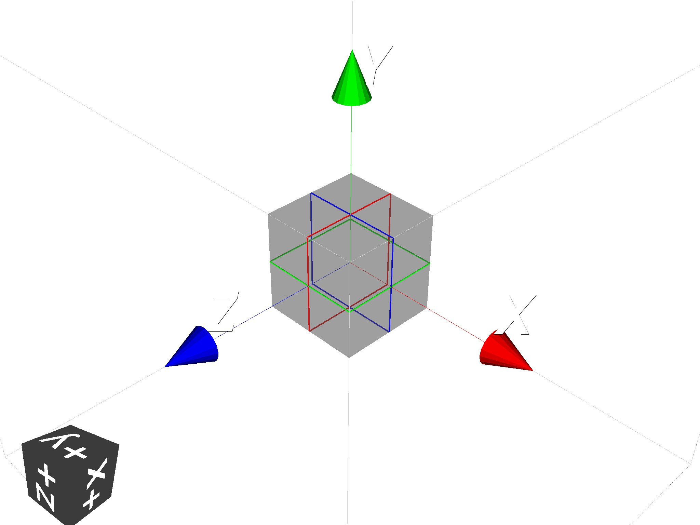

===============================
Basic python geometry scripting
===============================

Precepts
--------

* Units may be specified but default to Geant4 ones (e.g. mm, rad).
* Rotations are made using Tait-Bryan angles (rotation about reference x,y,z axes).
* A :class:`Registry` object should be used to hold all things related in a model
  and passed into the constructors of most objects.
* GDML-like **full lengths** are used instead of typically half lengths

Units
-----

* The default units are mm and rad for length and angle.
* Most constructors will take units as an optional key word argument ('kwarg').
* The kwargs are typically :code:`lunit` for length unit and :code:`aunit` for angle unit.
* Units are defined in :code:`pyg4ometry.gdml.Units.py`.

The following units (as strings) are accepted:

+-------------+------------------+
| **Unit**    | **Value**        |
+=============+==================+
| nm          | 1e-6             |
+-------------+------------------+
| um          | 1e-3             |
+-------------+------------------+
| mm          | 1                |
+-------------+------------------+
| cm          | 10               |
+-------------+------------------+
| m           | 1e3              |
+-------------+------------------+
| km          | 1e6              |
+-------------+------------------+
| deg         | :math:`\pi/180`  |
+-------------+------------------+
| degree      | :math:`\pi/180`  |
+-------------+------------------+
| rad         | 1                |
+-------------+------------------+
| radian      | 1                |
+-------------+------------------+
| mrad        | 1e-3             |
+-------------+------------------+
| urad        | 1e-6             |
+-------------+------------------+
| eV          | 1e-3             |
+-------------+------------------+
| keV         | 1                |
+-------------+------------------+
| MeV         | 1e+3             |
+-------------+------------------+
| none        | 1                |
+-------------+------------------+
| ns          | 1e-9             |
+-------------+------------------+
| us          | 1e-6             |
+-------------+------------------+
| ms          | 1e-3             |
+-------------+------------------+
| s           | 1                |
+-------------+------------------+

Examples:

.. code-block:: python

  reg = pyg4ometry.geant4.Registry()
  boxSolid = pyg4ometry.genat4.solid.Box("aBox", 10, 20, 30, reg)

This defines a box with the default units (none specifed), so mm. We can specify them:

.. code-block:: python

  boxSolid = pyg4ometry.genat4.solid.Box("aBox", 10, 20, 30, reg, "cm")

Geant4 Python Scripting 
-----------------------

Making use of pyg4ometry requires the following modules 

.. code-block :: python

   import pyg4ometry

To make a simple geometry of a box located at the origin

.. code-block :: python
   :linenos:

   # load pyg4ometry
   import pyg4ometry

   # registry to store gdml data
   reg  = pyg4ometry.geant4.Registry()

   # world solid and logical
   ws   = pyg4ometry.geant4.solid.Box("ws",50,50,50,reg)
   wl   = pyg4ometry.geant4.LogicalVolume(ws,"G4_Galactic","wl",reg)
   reg.setWorld(wl.name)

   # box placed at origin
   b1   = pyg4ometry.geant4.solid.Box("b1",10,10,10,reg)
   b1_l = pyg4ometry.geant4.LogicalVolume(b1,"G4_Fe","b1_l",reg)
   b1_p = pyg4ometry.geant4.PhysicalVolume([0,0,0],[0,0,0],b1_l,"b1_p",wl,reg)

   # visualise geometry
   v = pyg4ometry.visualisation.VtkViewer()
   v.addLogicalVolume(wl)
   v.addAxes(20)
   v.view()

Here is the vtk visualiser output of the above example

GDML Defines
------------

In GDML there are multiple ``define`` objects that can be used parameterise 
geometry, materials etc. These can be used as variables or definitions and
mean that any equations used will be retained in GDML output. For example a
GDML constant can be created in the following way 

.. code-block :: python

   # registry to store gdml data
   reg = pyg4ometry.geant4.Registry()

   # constant called x 
   x = pyg4ometry.gdml.Constant("x",10,reg)

The normal set of mathematical operations in python can be performed and 
evaluated

.. code-block :: python

   y = 2*x + 10
   y.eval()

.. code-block :: python

   >> 30

The constant ``x`` can of course be changed and ``y`` re-evaluated
   
.. code-block :: python

   x.setExpression(5)
   y.eval()

.. code-block :: python

   >> 20

.. note::
   Standard mathematical functions can be used with GDML defines (Constant, Variable, etc). So sin, cos, tan, 
   exp and so on, but pyg4ometry functions have to be used

.. code-block :: python
   :linenos:
   
   x  = pyg4ometry.gdml.Constant("x",10,reg)
   cx = pyg4ometry.gdml.cos(x)
   
So the box example above can be rewritten using constants

.. code-block :: python
   :linenos:     
   :emphasize-lines: 7-9,16

   # load pyg4ometry
   import pyg4ometry

   # registry to store gdml data
   reg  = pyg4ometry.geant4.Registry()

   bx = pyg4ometry.gdml.Constant("bx","10",reg,True)
   by = pyg4ometry.gdml.Constant("by",2*bx,reg,True)
   bz = pyg4ometry.gdml.Constant("bz",2*by,reg,True)

   # world solid and logical
   ws   = pyg4ometry.geant4.solid.Box("ws",50,50,50,reg)
   wl   = pyg4ometry.geant4.LogicalVolume(ws,"G4_Galactic","wl",reg)

   # box placed at origin
   b1   = pyg4ometry.geant4.solid.Box("b1",bx,by,bz,reg)
   b1_l = pyg4ometry.geant4.LogicalVolume(b1,"G4_Fe","b1_l",reg)
   b1_p = pyg4ometry.geant4.PhysicalVolume([0,0,0],[0,0,0],b1_l,"b1_p",wl,reg)

   # visualise geometry
   v = pyg4ometry.visualisation.VtkViewer()
   v.addLogicalVolume(wl)
   v.addAxes(20)
   v.view()

.. note::
   All GDML defines (Constant, Variable, etc) can be used in the construction of other pyg4ometry classes 
   interchangeably instead of floats or strings (where strings are either numbers or a GDML expression)

.. warning::
   Avoid reassigning variables used as defines, this can have unexpected consequences so for example 

   .. code-block:: python
      :linenos:

      b1   = pyg4ometry.geant4.solid.Box("b1",bx,by,bz,reg)
      b1.pX = 20              # do not do this
      b1.pX.setExpression(20) # rather do this

Solids
------

The python geant4 solids match the Geant4 constructors as much possible (different constructor signatures are not supported in python). For example looking at the ``G4Box`` class

.. code-block :: python

   pyg4ometry.geant4.solid.Box(name, pX, pY, pZ, registry, lunit)

.. code-block :: c++

   G4Box(const G4String& pName, G4double  pX, G4double  pY, G4double pZ)

A full list of solids can be found in :ref:`all-solids`.

.. warning::
   The parameters stick to the GDML convention of **full** lengths opposed to half lengths.

Materials
---------

As with solids materials are defined in a similar way to Geant4 C++. Python
does not have overloaded constructors, so unique signatures are needed, in 
contrast to Geant4.  

To define a material from the Geant4 predefined (e.g. NIST) materials 

.. code-block :: python
   :emphasize-lines: 2-3
   :linenos:

   import pyg4ometry.geant4 as _g4
   wm = _g4.MaterialPredefined("G4_Galactic")
   bm = _g4.MaterialPredefined("G4_Fe")

To define a single element in terms of atomic number, atomic mass and density.

.. code-block :: python
   :emphasize-lines: 2-3
   :linenos:

   import pyg4ometry.geant4 as _g4
   wm = _g4.MaterialSingleElement("galactic",1,1.008,1e-25,reg)   # low density hydrogen
   bm = _g4.MaterialSingleElement("iron",26,55.8452,7.874,reg)    # iron at near room temp

To define a compound two elements using the mass fraction

.. code-block :: python
   :emphasize-lines: 2
   :linenos:

   import pyg4ometry.geant4 as _g4
   wm = _g4.MaterialCompound("air",1.290e-3,2,reg)
   ne = _g4.ElementSimple("nitrogen","N",7,14.01)
   oe = _g4.ElementSimple("oxygen","O",8,16.0)
   wm.add_element_massfraction(ne,0.7)
   wm.add_element_massfraction(oe,0.3)
   bm = _g4.MaterialSingleElement("iron",26,55.8452,7.874,reg)    # iron at near room temp

To define a compound using number of atoms 

.. code-block :: python
   :emphasize-lines: 2
   :linenos:

   import pyg4ometry.geant4 as _g4
   bm = _g4.MaterialCompound("plastic",1.38,3,reg)    # Generic PET C_10 H_8 O_4
   he = _g4.ElementSimple("hydrogen","H",1,1.008)
   ce = _g4.ElementSimple("carbon","C",6,12.0096)
   oe = _g4.ElementSimple("oxygen","O",8,16.0)
   bm.add_element_natoms(he,8)
   bm.add_element_natoms(ce,10)
   bm.add_element_natoms(oe,4)

Material as a mixture of materials 

.. code-block :: python
   :emphasize-lines: 2
   :linenos:

   import pyg4ometry.geant4 as _g4
   bm     = _g4.MaterialCompound("YellowBrass_C26800", 8.14, 2, reg)
   copper = _g4.MaterialPredefined("G4_Cu")
   zinc   = _g4.MaterialPredefined("G4_Zn")
   bm.add_material(copper, 0.67)
   bm.add_material(zinc, 0.33)

Example of elements formed by isotopes

.. code-block :: python
   :emphasize-lines: 4
   :linenos:

   import pyg4ometry.geant4 as _g4
   u235 = _g4.Isotope("U235", 92, 235, 235.044)
   u238 = _g4.Isotope("U238", 92, 238, 238.051)
   uranium = _g4.ElementIsotopeMixture("uranium", "U", 2)
   uranium.add_isotope(u235, 0.00716)
   uranium.add_isotope(u238, 0.99284)
   bm = _g4.MaterialCompound("natural_uranium", 19.1, 1, reg)
   bm.add_element_massfraction(uranium, 1)

NIST Materials
**************

Geant4 has many predefined materials according to the NIST database. Their name typically starts
with :code:`G4_`. These typically can be used with :code:`MaterialPredefined` and we **do not need**
to specify the full composition - Geant4 will find them at run time.

However, in the case of conversion to FLUKA, these are fully expanded according to their definition
in Geant4 based on a cache in pyg4ometry of the material compositions generated using BDSIM from
Geant4 (10.7.p01 as of writing). Should the user wish to use these, they can be accessed from the
functions in the geant4 module.

.. code-block :: python
   :linenos:

   import pyg4ometry
   nistHydrogenElement = pyg4ometry.geant4.nist_element_2geant4Element('G4_H')

Note, an 'element' cannot be used as a 'material' in a logical volume. We must upgrade it to a material
for that. The NIST elements contain the appropriate mixture of natural isotopes and can be used in
:code:`MaterialCompound` as demonstrated above.

Alternatively, we can access the NIST materials and materials of elements.

.. code-block :: python
   :linenos:

   import pyg4ometry
   nistHydrogenMaterial = pyg4ometry.geant4.nist_material_2geant4Material('G4_H')
   nistConcreteMaterial = pyg4ometry.geant4.nist_material_2geant4Material('G4_CONCRETE')

Detector Construction
---------------------

This largely proceeds in exactly the same way as in G4 or GDML. Hierarchy of solids, booleans,
logical, physical (replica, division, param) volumes.

0. Create registry to hold everything
1. Create solids
2. Create logical volumes
3. Place logical volumes (construct physical volumes)
4. Visualise
5. Check
6. Export

Transformations & Physical Volumes
----------------------------------

Transformations in 3D are essential for the easy placement of solids in a CSG tree or
LV placement. There is not a specific transformation class like in Geant4. The matrices
and vectors used for placements are here typically Numpy arrays or matrices.

Geant4 has two possible constructors for a physical volume. These provide active and
passive transformations. In pyg4ometry, only one is provided.

* The transform in a physical volume first translates the placed logical volume
  with respect to the mother logical, then rotates it.

The physical volume class is documented here: :ref:`g4-module`, but an example
is shown here.

.. code-block:: python
   :linenos:

   import pyg4ometry
   r = pyg4ometry.geant4.Registry()
   vacuum = _g4.MaterialPredefined("G4_Galactic")
   water = _g4.MaterialPredefined("G4_WATER")
   worldSolid = pyg4ometry.geant4.solid.Box("world_solid", 100, 100, 100, reg)
   boxSolid = pyg4ometry.geant4.solid.Box("box_solid", 10, 20, 40, reg)
   worldLV = pyg4ometry.geant4.LogicalVolume(worldSolid, vacuum, "world_lv", reg)
   boxLV = pyg4ometry.geant4.LogicalVolume(boxSolid, water, "box_lv", reg)

   pyg4ometry.geant4.PhysicalVolume([0,0,0],
                                    [0,0,0],
				    boxLV,
				    "box_pv",
				    worldLV,
				    reg)

This creates a box of water inside a box of vacuum. The box of water is 10 x 20 x 50 mm long
(note mm are the default length units), and it is placed with no offset and no rotation (i.e.
at the centre) of the world volume. Alternatively: 

.. code-block:: python
   :linenos:

   import numpy as np
   pyg4ometry.geant4.PhysicalVolume([0,np.pi/3.0,0],
                                    [0,0,0],
				    boxLV,
				    "box_pv",
				    worldLV,
				    reg)

In this case, the box is placed with no offset but with a rotation of :math:`\pi/3` radians
about the y axis of the world box.

.. note:: The rotations are Tait-Bryan angles, which are rotations about the reference
	  x,y,z axes. i.e. if there is a rotation about both x and y, these are independent
	  and it is **not** a compound frame that is rotated. These are commonly thought of
	  like an aircraft and called pitch, yaw and tilt.

There are utility functions for translation between different transformations in
:code:`pyg4ometry.transformation`. See :ref:`transformation-module`.

Optical Surfaces
----------------

Optical surfaces can be created in a similar way as in Geant4 C++. A
:class:`pyg4ometry.geant4.solid.OpticalSurface` instance holds all the needed properties of the
surface (including extra properties, e.g. for optical processes). This is then assigned to
the surface between either

* two physical volumes: :class:`pyg4ometry.geant4.BorderSurface`, or
* a logical volume and all its neighbouring volumes: :class:`pyg4ometry.geant4.SkinSurface`.

.. code-block:: python
   :linenos:

   opa = _g4.solid.OpticalSurface("AirSurface", finish="polished", model="glisur", surf_type="dielectric_dielectric", value="1", registry=reg)
   opw = _g4.solid.OpticalSurface("WaterSurface", finish="ground", model="unified", surf_type="dielectric_dielectric", value="0", registry=reg)

   _g4.SkinSurface("AirSurface", air_lv, opa, reg)
   _g4.BorderSurface("WaterSurface", water_phys, world_phys, opw, reg)

Properties of Materials and Optical Surfaces
--------------------------------------------

Materials and optical surfaces support adding properties that can be used by Geant4 to
influence processes, e.g. for scintillation, refraction or other optical processes.

In the GDML, a matrix is used to hold the value(s) of the property.

* :code:`addProperty(name, matrix)` - Add a property based on an existing :class:`pyg4ometry.gdml.Matrix` object.
* :code:`addVecProperty(name, e, v, eunit='eV', vunit='')` - Add a property based on a energy vector and a value vector.
* :code:`addConstProperty(name, value, vunit='')`- Add a property that has only one constant value.

Units can be specified by setting the parameters ``eunit`` for the energy vector and
``vunit`` for the values. The given vectors are expected to be homogeneous in their units.

.. note:: Optical properties can only use units (or combinations of units) that are also
     defined in pyg4ometry. If needed, additional units can be added:
     :code:`pyg4ometry.gdml.Units.units['ps'] = 1e-12`.

.. code-block:: python
   :linenos:

   scint = _g4.Material(...)
   scint.addConstProperty('SCINTILLATIONTIMECONSTANT1', 2.5, vunit='ns')
   scint.addConstProperty('SCINTILLATIONYIELD', 8000, vunit='/MeV')
   scint.addVecProperty('RINDEX', [1, 10], [1.3, 1.05])

Registry and GDML Output
------------------------

Strictly speaking a registry class to store all of the GDML is not required. 
As with normal Geant4 given a ``lv`` pointer it should possible to form an aggregation 
hierarchy that contains all necessary objects. Now GDML breaks this as the
structure is built up using ``name`` tags. For example a placement requires 
a position. In Geant4 this would just be a pointer to an transformation object, but GDML 
has two mechanisms to represent this, firstly child nodes of a PhysicalVolume tag 
or secondly a position define, see below

The registry class is a storage class for a complete GDML file. At the
construction stage of almost all objects a registry is required. If the 
object is added to the registry then it will appear explicitly in the GDML 
output

Visualisation
-------------

Any logical volume ``lv`` can be visualised using:

.. code-block :: python
   :linenos:

    v = pyg4ometry.visualisation.VtkViewer()
    v.addLogicalVolume(lv)
    v.addAxes(20)
    v.view()

which will open a Vtk render window. The render window now receives keyboard and mouse commands. 
To exit render window ``q``, to restart interaction with the visualiser 

.. code-block :: python
   :linenos:

    v.start()

There are also convenience methods of ``pyg4ometry.visualisation.VtkViewer()`` the allow changing 
of the viewing parameters. So if the viewer is active then render window needs to be stopped ``q`` 
and then commands can be typed into the terminal, for example  

.. code-block :: python
   :linenos:

    v.setOpactity(0.1)
    v.setWirefrace()   
    v.start()

Overlap Checking
----------------

"Overlaps" is a general term used to describe malformed geometry. Such geometry is unphysical
and may causing particle tracking problems in simulations such as stuck particles, or particles
completely missing certain volumes entirely. Such errors are rarely easy to spot from results
or running the simulation.

Given all the PVs (daughters) of a LV (mother) should be bounded by the LV/mother solid. It is
possible to check between all daughter solid meshes and between daughters and the mother solid mesh.
Given an :code:`pyg4ometry.geant4.LogicalVolume` instance ("lv"), this check can be performed by calling
the following code:

.. code-block :: python

    lv.checkOverlaps()

This will check only the immediate daughters of this logical volume. To descend further into
a geometry, the recursive flag can be used:

.. code-block :: python

    lv.checkOverlaps(recursive=True)

See :ref:`g4-module` : :code:`LogicalVolume.checkOverlaps()` for full details. A more
complete example is:

.. code-block :: python
   :emphasize-lines: 5
   :linenos:

   # cd pyg4ometry/pyg4ometry/test/pythonGeant4
   import pyg4ometry
   r  = pyg4ometry.freecad.Reader("./T103_overlap_copl.gdml")
   l = r.getRegistry().getWorldVolume()
   l.checkOverlaps(recursive=False,coplanar=True,debugIO=False)   
   v = pyg4ometry.visualisation.VtkViewer() 
   v.addLogicalVolume(l)
   v.view()

.. figure:: pythonscripting/pythonscripting2.png
   :alt: Example overlap visualisation

Text is by default only printed out when an overlap is found. Any overlaps will be prepared
for visualisation in a VtkViewer (must be constructed and given the LV after this).

The following overlap checks are performed:

1. daughter with other daughter overlap
2. co-planar daughter with other daughter overlap
3. protrusion of a daughter from the mother volume
4. co-planar daughter with mother volume

Colour Coding
*************

In the visualiser, text will be overlaid saying "overlap" where some kind of overlap is detected.
Additionally, the actual overlap itself will be visualised and colour coded according to:

* red: protrusion overlap
* green: daughter-daughter overlap
* blue: co-planar overlap

Limitations
***********

1. The overlap detection is performed by checking for overlaps in the visualisation meshes
   generated for each volume. In the case of curved solids (e.g. a cylinder), the mesh is
   not truly curved but a polygon. Very closely spaced curved surfaces may produce false
   overlaps. By default, all curved solids will use the same number of points around a circle,
   so usually we can "get away" with this if the curved solids aren't rotated about their axis.
2. Currently, division and parameterised volumes are not handled explicitly.

Assemblies
**********

In the case of assembly volumes, and if an overlap is detected, a unique name is built up
based on the parent PhysicalVolume, the assembly and the PhysicalVolume inside it. Furthermore, this
is done recursively is assemblies of assemblies (etc) are used. The name is built up with an
underscore "_" for padding and the user should decode this from their input.

As there is no 'mother' of an
assembly, there is no mother protrusion directly. The contents of an assembly are compared to
all other daughters and the mother at the higher level in which they are placed.

GDML Output
-----------

To write an GDML file file given a :code:`pyg4ometry.geant4.registy` instance  :code:`reg`.   

.. code-block :: python
   :emphasize-lines: 3
   :linenos:

   import pyg4ometry
   w = p4gometry.gdml.Writer()
   w.addDetector(reg)
   w.write('file.gdml')
   # make a quick bdsim job for the one component in a beam line
   w.writeGmadTester('file.gmad', 'file.gdml')

