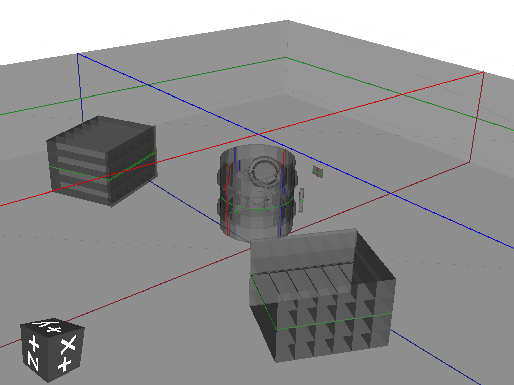
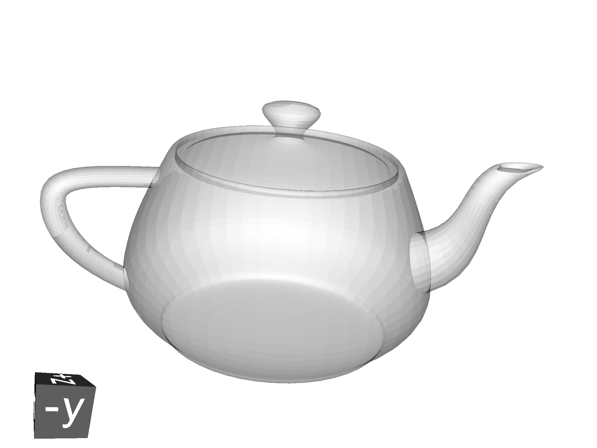

=========
Tutorials
=========

GDML Loading
------------

In directory ``pyg4ometry/pyg4ometry/test/gdmlG4examples/ChargeExchangeMC/``

.. code-block :: python
   :linenos:

   import pyg4ometry
   r = pyg4ometry.gdml.Reader("lht.gdml")
   l = r.getRegistry().getWorldVolume()
   v = pyg4ometry.visualisation.VtkViewer()
   v.addLogicalVolume(l)
   v.view()

STL Loading
-----------

STL files are typically used for a single watertight solid mesh. This mesh is
converted to a TesselatedSolid and then a logical volume which can be placed
in a geometry. In directory ``pyg4ometry/pyg4ometry/test/stl``.

.. code-block :: python

   import pyg4ometry
   reg = pyg4ometry.geant4.Registry()
   r = pyg4ometry.stl.Reader("utahteapot.stl" registry=reg)
   s = r.getSolid()
   copper = pyg4ometry.geant4.MaterialPredefined("G4_Cu")
   l = pyg4ometry.geant4.LogicalVolume(s, copper, "utahteapot_lv", reg)
   v = pyg4ometry.visualisation.VtkViewer()
   v.addLogicalVolume(l)
   v.view()

STEP/STP Loading
----------------

In directory ``pyg4ometry/pyg4ometry/test/freecad``

.. code-block :: python
   :linenos:

   import pyg4ometry
   r  = pyg4ometry.freecad.Reader("./08_AshTray.step")
   r.relabelModel()
   r.convertFlat()
   l = r.getRegistry().getWorldVolume()
   v = pyg4ometry.visualisation.VtkViewer()
   v.addLogicalVolume(l)
   v.view()

.. figure:: tutorials/tutorial3.png
   :alt: Example of STEP loading in pyg4ometry

Merging Geometry
----------------

There are ways to incorporate geometry from multiple sources in GDML. This has potentially
lots of problems as each file needs to be a well formed GDML file and care has to be taken
with degenerate names from the different sources. For example a volume can be extracted
from GdmlFile1 and added to GdmlFile2, clearly all solids, materials and variables need
to also transferred. For this example we need two GDML files, so ``pyg4ometry/test/pythonGeant4/T001_Box.py``
and ``pyg4ometry/test/pythonGeant4/T002_Tubs.py``, so run them

.. code-block :: python
   :linenos:

   import T001_Box
   T001_Box.Test(True,True)

   import T002_Tubs
   T002_Tubs(True,True)

This will create two GDML files ``T001_Box.gdml`` and ``T002_Tubs.gdml``. It is possible to
find the volumes contained in each file (using the tubs gdml file as the example)
by performing the following

.. code-block :: python
   :linenos:

   import pyg4ometry
   r = pyg4ometry.gdml.Reader("T002_Tubs.gdml")
   reg = r.getRegistry()

   # printing the names of the logical volumes
   print(reg.logicalVolumeDict.keys())

   # printing the names of the physical volumes
   print(reg.physicalVolumeDict.keys())

   lv = reg.logicalVolume["tl"]

Now merging the ``tl`` logicalVolume (which is a simple tubs) with the box gdml file

.. code-block :: python
   :linenos:
   :emphasize-lines: 13

   import pyg4ometry
   r1 = pyg4ometry.gdml.Reader("T001_Box.gdml")
   reg1 = r1.getRegistry()

   r2 = pyg4ometry.gdml.Reader("T002_Tubs.gdml")
   reg2 = r2.getRegistry()

   lv = reg2.logicalVolumeDict["tl"]

   # create physical volume with placement
   pv = pyg4ometry.geant4.PhysicalVolume([0,0,0],[50,0,0], lv, "tl_pv", reg1.getWorldVolume(), reg1)

   reg1.addVolumeRecursive(pv)

   # gdml output
   w = pyg4ometry.gdml.Writer()
   w.addDetector(reg1)
   w.write("MergeRegistry.gdml")

.. note::
   In the example two registry objects are created and objects from reg2 are merged into reg1. Of course one
   registry might be formed by pyg4ometry commands opposed created from a file.

.. warning::
   The pv needs to added with addVolumeRecursive otherwise it is possible that GDML definitions which lv depends
   on are not transferred over.

Assembly Conversion
-------------------

Given two sources of geometry, placement of top level world logical volume solids will
likely result in an overlap. To avoid these types of problems, it might required to convert
one of the logical volumes to an AssemblyVolume.

STL Output
----------

To write an STL file from ``m = volume.pycsgmesh()``

.. code-block :: python
   :linenos:

    vtkConverter = vtk.Convert()
    vtkPD        =  vtkConverter.MeshListToPolyData(m)
    r = vtk.WriteSTL("file.stl",vtkPD)

GDML Conversion to FLUKA
------------------------

It is possible convert a pyg4ometry geometry to FLUKA. This is currently a work in
progress and not all Geant4-GDML constructions are implemented, although they can
be quickly added. Given a LV variable named ``logical``

.. code-block :: python
   :linenos:

   import pyg4ometry
   reader = pyg4ometry.gdml.Reader("input.gdml")
   logical = reader.getRegistry().getWorldVolume()
   freg = pyg4ometry.convert.geant4Logical2Fluka(logical)
   w = pyg4ometry.fluka.Writer()
   w.addDetector(freg)
   w.write("FileName.inp")

If you want to load a file into Flair then a flair file can be written based on ``FileName.inp`` using the following

.. code-block :: python
   :linenos:

    extent = logical.extent(includeBoundingSolid=True)
    f = pyg4ometry.fluka.Flair("FileName.inp",extent)
    f.write("FileName.flair")

Here is an example (viewed in Flair) of a simple Geant G4 solid that has been converted to FLUKA using this
method

.. figure:: tutorials/tutorial8a.png
   :alt: GDML CutTubs

.. figure:: tutorials/tutorial8b.png
   :alt: GDML CutTubs converted to FLUKA

.. note::
   All GDML placements are respected in the conversion from GDML to FLUKA, for both Placements and
   Boolean Solids. So for example a tree of LV-PV placements are reduced into a single transformation
   of a LV into a global coordinate space for FLUKA. A similar process is used for a tree of CSG
   operations.

.. warning::

   Currently there are some things which are not implemented in the conversion. 1) Materials, 2) Scaled solids,
   3) Reflections in placements, 4) Division, replica and parameterised placements. Some of these are straight
   forward to implement, like Materials and the non-Placement physical volumes can be done quickly if a user
   requires it.

Conversion of FLUKA To GDML
---------------------------

FLUKA geometry can be converted to GDML using
``pyg4ometry.convert.fluka2geant4``. The conversion process is robust and
supports all FLUKA geometry constructs.  Given a FLUKA file `model.inp`,
the following code can be used to translate it to a GDML file.

.. code-block :: python
   :linenos:

   import pyg4ometry.fluka as fluka
   import pyg4ometry.gdml as gdml
   from pyg4ometry.convert import fluka2Geant4

   # Read the FLUKA file, get the FlukaRegistry, convert the registry to a
   # Geant4 Registry
   reader = fluka.Reader("model.inp")
   flukaregistry = reader.flukaregistry
   geant4Registry = fluka2Geant4(flukaRegistry)

   worldLogicalVolume = geant4Registry.getWorldVolume()
   worldLogicalVolume.clipSolid()

   writer = gdml.Writer()
   writer.addDetector(geant4Registry)
   writer.write("model.gdml")

The core of this functionality is the translation of the `FlukaRegistry`
instance into the equivalent `Registry` (i.e. Geant4) instance.

Here is an example of a model viewed in flair and the resulting visualisation
in VTK of the Geant4 model

.. figure:: tutorials/faradayCupFlair.png
   :alt: A faraday cup designed and viewed in flair

.. figure:: tutorials/faradayCupVTK.png
   :alt: A faraday cup converted from FLAIR to Geant4 and shown in VTK

A number of keyword arguments are available to further modify the
conversion.  The `fluka2Geant4` keyword arguments `region` and
`omitRegions` allow the user to select a subset of the named regions to be
translated.

The conversion of QUA bodies (fluka2geant4 kwarg `quadricRegionAABBs`) is
complex and requires further explanation. In Pyg4ometry the mesh and GDML
representations of FLUKA infinite circular cylinders, elliptical cylinders
and half-spaces are all finite (but very large) cylinders, elliptical
cylinders and boxes.  This is robust as increasing the length of cylinders
and depth/bredth of boxes does not increase the number of polygons used in
the underlying mesh representation for that solid.  However, this is not
true of the quadric surface.  A quadric surface cannot simply be generated
to be "very large", as the number of polygons will grow quickly, along with
the memory consumption and facets in the resulting GDML TesselatedSolid,
which will also slowing down tracking time in Geant4.  For this reason the
user must provide axis-aligned bounding boxes of the regions where any QUA
bodies are present.  It is recommended that these boxes be a centimetre
larger than formally necessary to ensure a correct conversion.  Providing
the bounding box ensures that an efficient and accurate mesh of the QUA
bodies can be generated meaning that the conversion to be performed in a
tractable amount of time as well giving more performant tracking in Geant4.

Geometry Complexity Analysis
----------------------------

For a given logical volume we can get some statistics on the complexity
of the geometry. A simple class called `GeometryComplexityInformation` is
returned that has a serious of dictionaries with information. ::

  cd pyg4ometry/pyg4ometry/test/gdmlCompoundExamples/bdsim_2
  ipython
  >>> import pyg4ometry
  >>> r = pyg4ometry.gdml.Reader("22-size-variation-facetcrop-quad.gdml")
  >>> info = pyg4ometry.geant4.AnalyseGeometryComplexity(r.getRegistry().getWorldVolume())
  >>> info.printSummary()
  Types of solids
  ExtrudedSolid        : 96
  Tubs                 : 51
  Intersection         : 24
  Polyhedra            : 12
  Subtraction          : 6
  Box                  : 1
 
  # of daughters       count
  0                    : 152
  2                    : 19
  4                    : 12
  13                   : 6
  25                   : 1
 
  Depth of booleans    count
  1                    : 30
 
  Booleans width depth over  3
  Solid name                               : n Booleans

  >>> info. <tab>
  comp.booleanDepth      comp.nDaughtersPerLV  
  comp.booleanDepthCount comp.printSummary     
  comp.nDaughters        comp.solids
